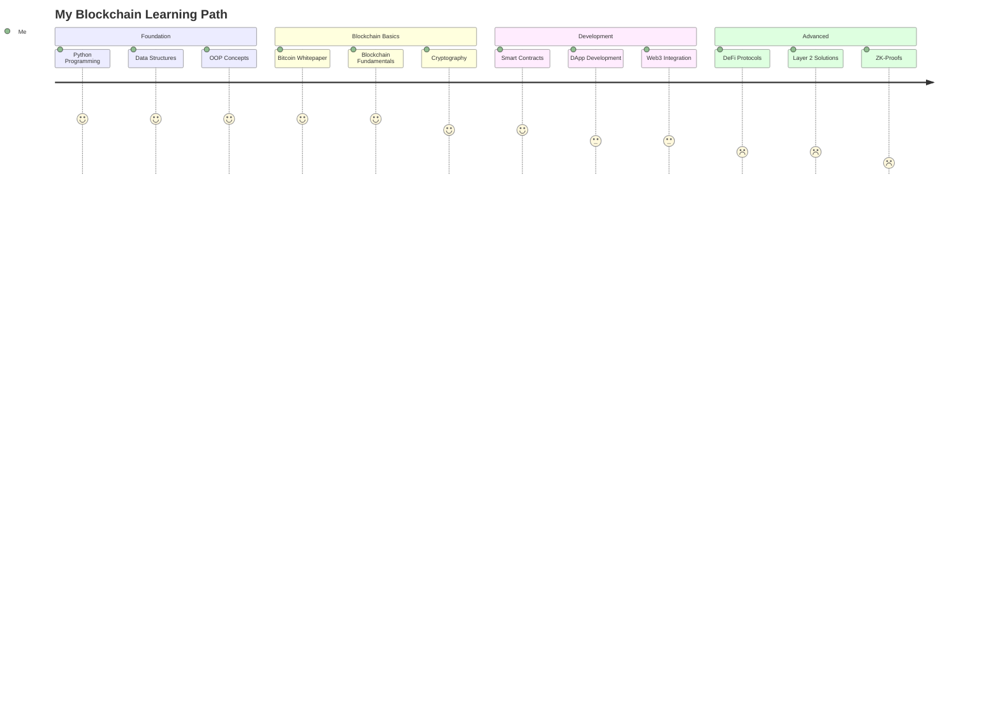

<div align="center">

<!-- Animated Header -->


<!-- Typing Animation -->
<p>
  
</p>

<!-- Profile Views Badge -->
<p>
  
</p>

<!-- Social Badges -->
<p>
  <a href="https://github.com/saurabhsingh-98">
    
  </a>
  <a href="https://linkedin.com/in/yourlinkedin">
    
  </a>
  <a href="mailto:your.email@example.com">
    
  </a>
</p>

<br/>

</div>

---

## 🚀 About Me

```python
class SaurabhSinghRajput:
    def __init__(self):
        self.name = "Saurabh Singh Rajput"
        self.username = "saurabhsingh-98"
        self.location = "India 🇮🇳"
        self.education = {
            "degree": "B.Tech in Computer Science & Engineering",
            "specialization": "Blockchain Technology",
            "year": "2nd Year",
            "institution": "PIET (Parul Institute of Engineering and Technology)"
        }
        self.role = "Blockchain Developer & Student"
        self.interests = [
            "Blockchain Development",
            "Cryptocurrency",
            "Smart Contracts",
            "Decentralized Applications",
            "AI & Machine Learning",
            "Backend Development"
        ]
    
    def say_hi(self):
        print("Thanks for visiting! Let's build the decentralized future together!")

me = SaurabhSinghRajput()
me.say_hi()
```

<br/>

---

## 💻 Tech Stack

<div align="center">

### Languages


### Blockchain & Web3


### Tools & Technologies


</div>

<br/>

---

## 🏆 Certifications & Achievements

<div align="center">

| Certification | Platform | Skills |
|:-------------:|:--------:|:------:|
| 🏅 **Python** | HackerRank | Advanced |
| 🏅 **C++** | HackerRank | Advanced |
| 🏅 **Java** | HackerRank | Intermediate |
| 🤖 **Automation Anywhere** | Automation Anywhere | Essentials Developer |

</div>

<br/>

---

## 🔥 Featured Project

<div align="center">

<table>
<tr>
<td align="center">

### 💰 Crypto Portfolio Tracker
**Terminal-based tracker using CoinGecko API**


A terminal-based cryptocurrency portfolio tracker featuring:
- 📊 Real-time price tracking using CoinGecko API
- 💰 Portfolio management and balance tracking  
- 📈 Profit/Loss calculations
- 🔍 Cryptocurrency search functionality
- 💎 Clean terminal interface

[](https://github.com/saurabhsingh-98/crypto-portfolio-tracker)

**Tech Stack:** Python • CoinGecko API • Terminal UI

</td>
</tr>
</table>

</div>

<br/>

---

## 📊 GitHub Statistics

<div align="center">


</div>

<br/>

---

## 🎯 Current Focus

```javascript
const currentlyLearning = {
    blockchain: ["Smart Contract Security", "DeFi Protocols", "Layer 2 Solutions"],
    languages: ["Rust (Advanced)", "Solidity", "Go"],
    technologies: ["Web3.js", "Hardhat", "IPFS"],
    projects: ["Building DApp", "NFT Marketplace", "DAO Implementation"]
};

const goals2026 = [
    "🎓 Complete Blockchain specialization",
    "🚀 Launch 3+ production DApps",
    "💼 Contribute to major blockchain projects",
    "📝 Write technical blogs on Web3",
    "🤝 Network with blockchain community"
];
```

<br/>

---

## 💡 Skills & Expertise

<div align="center">

<table>
<tr>
<td valign="top" width="33%">

### 🔗 Blockchain
- Smart Contract Development
- Consensus Mechanisms
- Cryptographic Protocols
- DApp Architecture
- Token Standards
- Blockchain Security

</td>
<td valign="top" width="33%">

### 💻 Development
- Object-Oriented Programming
- Data Structures & Algorithms
- System Design
- RESTful APIs
- Database Management
- Version Control (Git)

</td>
<td valign="top" width="33%">

### 🧠 Emerging Tech
- Machine Learning Basics
- Natural Language Processing
- Automation & Scripting
- Cloud Technologies
- DevOps Fundamentals
- CI/CD Pipelines

</td>
</tr>
</table>

</div>

<br/>

---

## 🌱 Learning Journey



<br/>

---

## 📫 Connect With Me

<div align="center">

**Let's collaborate and build something amazing!**

<p>
<a href="https://github.com/saurabhsingh-98">
  
</a>
<a href="https://linkedin.com/in/yourlinkedin">
  
</a>
<a href="https://twitter.com/yourtwitter">
  
</a>
<a href="mailto:your.email@example.com">
  
</a>
</p>

**📧 Email:** your.email@example.com  
**🌐 Portfolio:** [saurabhsingh-98.github.io](https://saurabhsingh-98.github.io)  
**🎓 Institution:** PIET - Parul Institute of Engineering and Technology

</div>

<br/>

---

## 🎨 Contribution Graph

<div align="center">


</div>

<br/>

---

## 🏅 GitHub Trophies

<div align="center">


</div>

<br/>

---

## 💭 Random Dev Quote

<div align="center">


</div>

<br/>

---

## 📈 Weekly Coding Stats

<!--START_SECTION:waka-->
```text
Python       12 hrs 30 mins  ████████████░░░░░░░░░   48.5%
Rust         6 hrs 15 mins   ██████░░░░░░░░░░░░░░░   24.2%
JavaScript   3 hrs 45 mins   ███░░░░░░░░░░░░░░░░░░   14.5%
Solidity     2 hrs 10 mins   ██░░░░░░░░░░░░░░░░░░░    8.4%
Other        1 hr 10 mins    █░░░░░░░░░░░░░░░░░░░░    4.4%
```
<!--END_SECTION:waka-->

<br/>

---

<div align="center">

### 💎 "Building the decentralized future, one block at a time"

**⭐ From [saurabhsingh-98](https://github.com/saurabhsingh-98)**


</div>
